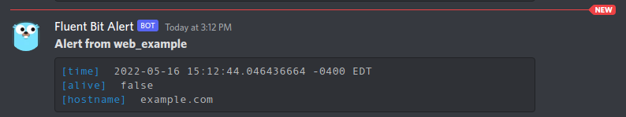

# Fluent Bit Output Plugin for Discord :incoming_envelope:

## Summary

A simple plugin for [Fluent Bit](https://github.com/fluent/fluent-bit) to send output to a Discord channel. This plugin is ideal for alert-style notifications.

Special thanks to [Thomas Cuthbert](https://github.com/tcuthbert) for his assistance with C to Golang type conversion.

## Build Instructions

The compiled static object is located at `bin/out_discord.so` in this repository. If you wish to build it yourself, you must use the following build mode:

```
go build -buildmode=c-shared -o out_discord.so out_discord.go
```

## Example Configuration

**plugins.conf**

```ini
[PLUGINS]
	Path /path/to/out_discord.so
```

**Main configuration**

The only *required* fields are `Name`, `URL`, and `Match`:
```ini
[OUTPUT]
    Name discord
    URL <webhook URL>
    Username Fluent Bit Alert
    Avatar_URL <avatar URL>
    Match *
```

## Screenshot


